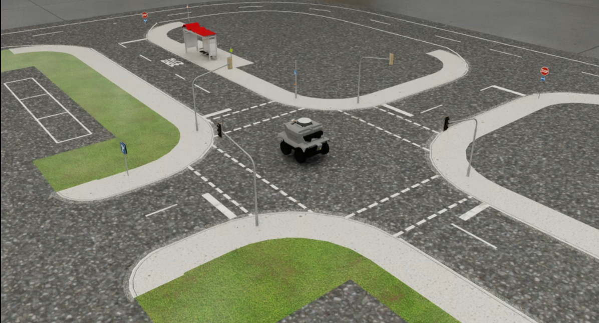
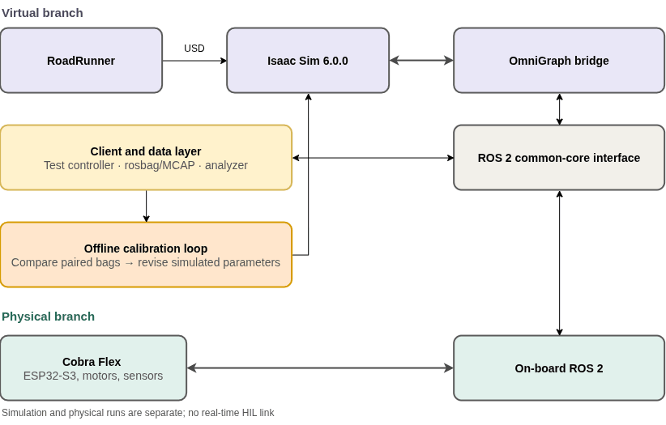
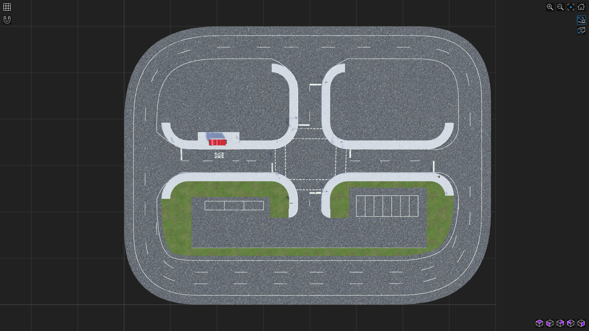

# CobraFlex Digital Twin in Isaac Sim

**ROS 2-Compatible Digital Twin Platform for a 1:14 Scaled Autonomous Vehicle**

A research platform built with **NVIDIA Isaac Sim, PhysX, OpenUSD, MathWorks RoadRunner, and ROS 2** for scaled autonomous-vehicle simulation, Sim-to-Real evaluation, and future learning-based control research.

<p align="center">
  
</p>

---

## Overview

This repository contains the digital-twin platform developed for the **1:14 CobraFlex scaled autonomous vehicle**.

The platform combines:

- a PhysX-based CobraFlex vehicle model in NVIDIA Isaac Sim;
- a scaled urban road environment generated with RoadRunner/OpenDRIVE;
- ROS 2 interfaces for vehicle commands, state feedback, TF, joint states, and virtual sensors;
- repeatable control, rosbag/MCAP recording, analysis, calibration, and validation workflows.

The digital twin was calibrated and evaluated against measurements from the physical CobraFlex platform using straight-line, curved-path, and in-place rotation experiments.

This repository is intended as a **research handover package**. It preserves the formal thesis baseline and the supporting interfaces, assets, and documentation so that future work can start from a known and traceable configuration.

> **Scope:** The thesis establishes the simulation platform and ROS 2 interface required for future learning-based control research. Reinforcement-learning policy development, training, and real-vehicle policy deployment are outside the thesis scope.

---

## Key Features

- **1:14 CobraFlex digital twin** modeled with PhysX Articulation
- **Scaled RoadRunner/OpenDRIVE environment** for autonomous-driving experiments
- **ROS 2-compatible command and state interface**
- TF, joint-state, odometry, camera, and IMU data paths
- Sim-to-Real calibration and validation workflow
- Frozen, reproducible thesis baseline
- Diagnostic tooling for vehicle-motion experiments
- Clear separation between formal delivery assets and diagnostic variants

---

## System Architecture

The platform contains a virtual branch and a physical branch connected through a common ROS 2 interface. Simulation and physical experiments are recorded separately and compared through an offline calibration workflow.

<p align="center">
  
</p>

The main layers are:

1. **Vehicle model** — CobraFlex rigid-body and wheel articulation model in Isaac Sim
2. **Environment** — scaled road network generated with RoadRunner and OpenDRIVE
3. **Simulation and sensing** — PhysX dynamics, rendering, and virtual sensor pipelines
4. **ROS 2 interface** — command input, state feedback, TF, joint states, and sensor streams
5. **Client and data layer** — test control, rosbag/MCAP recording, and analysis
6. **Offline calibration loop** — paired physical/simulation comparison and parameter revision

> Simulation and physical runs are separate; the thesis does not implement a real-time HIL link.

---

## Road Environment

The scaled road environment was created in **MathWorks RoadRunner** and transferred to Isaac Sim through the OpenUSD/OpenDRIVE workflow.

It includes:

- an outer driving loop;
- central intersections;
- parking areas;
- traffic signs;
- traffic lights;
- a bus-stop area;
- lane-network assets for future autonomous-driving and RL workflows.

<p align="center">
  
</p>

The final road-network exchange files are provided under `roadrunner/`, including the versioned OpenDRIVE and GeoJSON files and the Junction 63 repair record.

---

## Repository Layout

```text
IsaacSim-ROS2-Autonomous-scaled-vehicles/
├── README.md
├── HANDOVER.md
├── CHANGELOG.md
├── LICENSE
│
├── assets/
│   ├── vehicle/
│   ├── environment/
│   └── scenes/
│
├── config/
│   ├── baseline.yaml
│   ├── ros2_topics.yaml
│   └── README.md
│
├── ros2/
│   ├── control/
│   ├── analysis/
│   └── utilities/
│
├── roadrunner/
│   ├── OpenDRIVE/
│   ├── GeoJSON/
│   ├── docs/
│   └── README.md
│
├── calibration/
├── validation/
├── docs/
│   └── images/
└── thesis/
```

Historical development files, obsolete USD variants, and large raw ROS bag recordings should remain outside the formal baseline package unless explicitly archived for traceability.

---

## Requirements

### Simulation

- **NVIDIA Isaac Sim 6.0.0**
- PhysX
- OpenUSD
- Isaac Sim ROS 2 Bridge

### Middleware

- ROS 2
- `rosbag2`
- MCAP support where required by the analysis workflow
- Git LFS for the formal USD assets

### Environment Generation

- MathWorks RoadRunner
- OpenDRIVE workflow

### Analysis

Python-based analysis scripts are used for calibration and validation. Required Python packages should be documented alongside the final analysis tools.

> Record the exact ROS 2 distribution and workstation setup in `docs/installation.md` before external release.

---

## Formal Delivery Assets

The formal thesis baseline consists of three USD assets:

```text
ADMIT14_cobraflex_baseline_v1.usd
ADMIT14_RoadRunner_Map_v1.usd
ADMIT14_Integrated_Scene_v1.usd
```

Recommended repository locations:

```text
assets/vehicle/ADMIT14_cobraflex_baseline_v1.usd
assets/environment/ADMIT14_RoadRunner_Map_v1.usd
assets/scenes/ADMIT14_Integrated_Scene_v1.usd
```

These files define the formal delivered baseline.

The binary `.usd` assets are tracked with **Git LFS**. This is required because the integrated scene exceeds GitHub's normal per-file Git limit. Diagnostic or experimental USD files must be clearly separated and must **not** overwrite the `v1` assets.

---

## Quick Start

### 1. Clone the repository

Install and initialise Git LFS before cloning or pulling the formal USD assets.

```bash
git lfs install
git clone <repository-url>
cd IsaacSim-ROS2-Autonomous-scaled-vehicles
git lfs pull
```

### 2. Source ROS 2

```bash
source /opt/ros/<distro>/setup.bash
```

### 3. Open the integrated scene

Open:

```text
assets/scenes/ADMIT14_Integrated_Scene_v1.usd
```

in Isaac Sim.

Enable the required ROS 2 bridge extensions and start the simulation.

### 4. Verify ROS 2 communication

```bash
ros2 topic list
```

### 5. Send a basic vehicle command

Straight-line example:

```bash
ros2 topic pub /cmd_vel geometry_msgs/msg/Twist \
"{linear: {x: 0.20}, angular: {z: 0.0}}" -r 10
```

Stop command:

```bash
ros2 topic pub /cmd_vel geometry_msgs/msg/Twist \
"{linear: {x: 0.0}, angular: {z: 0.0}}" -1
```

For reset procedures, bag recording, validation runs, and analyzer usage, see `HANDOVER.md`.

---

## ROS 2 Interface

The final architecture includes the following core interfaces.

| Interface | Direction | Purpose |
|---|---|---|
| `/cmd_vel` | ROS 2 → Simulation | Linear and angular velocity command |
| `/clock` | Simulation → ROS 2 | Simulation clock |
| `/odom_truth` | Simulation → ROS 2 | Simulation odometry / reference vehicle state |
| `/joint_states` | Simulation → ROS 2 | Wheel-joint states |
| `/tf` | Simulation → ROS 2 | Dynamic transforms |
| IMU topic | Simulation → ROS 2 | Simulated inertial data |
| Lane Camera Image | Simulation → ROS 2 | RGB image stream |
| Lane Camera `CameraInfo` | Simulation → ROS 2 | Camera calibration/projection information |
| `/scan` | Simulation → ROS 2 | LiDAR scan output |
| `/cobraflex/wheel_cmd_debug` | Simulation → ROS 2 | Wheel-command diagnostics |

The physics simulation runs at **240 Hz**. The state/TF/joint publication chain uses a Gate step of 4, corresponding to **60 Hz simulation time**.

Sensor namespaces may depend on the final scene configuration. Record exact deployed topic names in `config/ros2_topics.yaml`.

---

## Final Simulation Baseline

The formal thesis baseline uses the following core configuration.

| Parameter | Baseline |
|---|---:|
| Isaac Sim | 6.0.0 |
| Physics rate | 240 Hz |
| Dynamics | CPU dynamics / GPU Dynamics OFF |
| Solver | PGS |
| Articulation iterations | 32 position / 1 velocity |
| Vehicle mass | 3.50 kg |
| Wheelbase | 0.154 m |
| Track width | approx. 0.153 m |
| Wheel radius | 0.03725 m |
| Joint drive | Force drive |
| Joint stiffness | 0 |
| Joint damping | 10,000 |
| Max drive force | 1.8 N·m per wheel |
| State / TF / joint publication | 60 Hz |

The formal USD assets are the authoritative delivered configuration. A machine-readable summary should additionally be maintained in:

```text
config/baseline.yaml
```

> **Important:** The **0.08 N·m** Max Drive Force configuration was used only as a diagnostic ablation. It is **not** the formal thesis baseline.

---

## Validation Summary

The platform was evaluated against the physical CobraFlex vehicle and through ROS 2 interface checks.

| Area | Status |
|---|---|
| Formal vehicle and environment assets | Completed |
| ROS 2 command/state interface | Validated |
| `/clock`, TF, and joint-state publication | Validated |
| Lane Camera payload/interface | Validated |
| Straight-line vehicle response | Evaluated against physical vehicle |
| Curved-path response | Evaluated; remaining Sim-to-Real gap documented |
| In-place rotation | Evaluated; branch/solver/contact behaviour remains documented |
| RL environment interface | Delivered |
| RL policy training | Outside thesis scope |

The final validation showed that straight-line behaviour can be reproduced closely in the tested range, while curved-path and in-place rotation behaviour retain larger discrepancies. The rotation diagnostics also revealed branch-dependent simulation behaviour under specific tested conditions.

These findings define the current **validity boundary** of the thesis baseline rather than implying exact dynamic equivalence under all operating conditions.

Detailed experiment definitions, processed results, and plots should be stored under `validation/`.

---

## Known Limitations

This simulator should **not** be interpreted as an exact dynamic replica of the physical vehicle under every operating condition.

Current handover boundaries include:

- curved-path understeer is not fully reproduced;
- in-place rotation can exhibit branch- and solver/contact-dependent behaviour;
- the validated operating range is limited to the conditions evaluated in the thesis;
- PGS/TGS and Max Drive Force sweeps are diagnostic studies, not complete tire or motor models;
- sensor publication and payload integrity were verified at interface level, not as full perception-model validation;
- reinforcement-learning policy training and real-vehicle policy transfer were not performed in this thesis.

Future calibration or controller work should therefore preserve the thesis baseline and create a new version rather than silently changing the delivered configuration.

---

## Data and Reproducibility

Large raw ROS bag recordings are intentionally excluded from the main Git repository.

The handover package should contain:

- configuration files;
- experiment metadata;
- analysis scripts;
- processed validation summaries;
- key plots and figures;
- small representative datasets where useful;
- provenance information linking results to controller, analyzer, USD, and physics versions.

Raw recordings should remain in the project or institutional archive and be referenced from:

```text
docs/data_provenance.md
```

The core reproducibility rule is:

> **Do not rewrite historical experiments using newer settings. Keep the formal thesis baseline frozen and version all future changes separately.**

---

## Handover Rules

Future development should follow these rules:

1. Do not overwrite the three formal `v1` USD assets.
2. Create a new version when changing vehicle physics, environment geometry, or ROS 2 behaviour.
3. Keep diagnostic configurations separate from the formal baseline.
4. Record configuration changes before generating new validation datasets.
5. Preserve the link between experiment data, controller version, analyzer version, USD asset, and physics configuration.
6. Perform a clean-clone acceptance test before publishing a new release.

---

## Handover Acceptance Test

A release is considered usable when a new user can, using only the repository documentation:

1. identify the three formal USD assets;
2. open the integrated scene;
3. start the ROS 2 bridge;
4. observe `/clock`;
5. observe vehicle state, TF, and joint states;
6. send `/cmd_vel`;
7. move and stop the vehicle;
8. access the Lane Camera stream;
9. record a ROS bag;
10. run the provided analyzer;
11. identify the formal physics baseline; and
12. identify the documented validity boundaries and known limitations.

---

## Thesis

This repository accompanies the Master's thesis:

> **Design and Implementation of a ROS 2-Compatible Digital Twin Platform for 1:14 Scaled Autonomous Vehicles in Reinforcement Learning**

| Role | Information |
| --- | --- |
| **Author** | Hwa-Luen,Lai (Warren) |
| **Supervisor** | Prof. Dr.-Ing. Ralf Schüler |
| **Institution** | Hochschule Esslingen |
| **Programme** | Automotive Systems, M.Eng. |
| **Year** | 2026 |

The thesis focuses on digital-twin environment generation, vehicle-model calibration, ROS 2 integration, and Sim-to-Real evaluation for the **1:14 CobraFlex research vehicle**.

---

## Citation

If this repository or the associated work is used in academic research, please cite the thesis:

```bibtex
@mastersthesis{lai2026cobraflex,
  author = {Hwa-Luen,Lai},
  title  = {Design and Implementation of a ROS 2-Compatible Digital Twin Platform for 1:14 Scaled Autonomous Vehicles for Reinforcement Learning},
  school = {Hochschule Esslingen},
  year   = {2026}
}
```

The citation will be updated if a permanent institutional publication URL or identifier becomes available.

---

## License

The licensing of this repository has **not yet been finalised**.

Until a final licensing decision is made, this repository should **not be assumed to grant permission for reuse, redistribution, or modification** of its contents.

Before any public release, redistribution rights must be verified for:

- USD assets;
- RoadRunner/OpenDRIVE exports;
- third-party 3D models and textures;
- external software components;
- datasets and recorded experimental material.

A final `LICENSE` file should be added only after these rights and the intended licensing terms have been confirmed.

---

## Thesis Baseline Release

The frozen thesis handover baseline is intended to be tagged as:

```text
v1.0.0-thesis
```

Future development should build from this tagged baseline rather than overwriting the archived thesis configuration.
