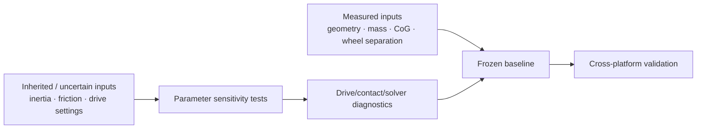

# Calibration and Diagnostic Evaluation

This document summarises the calibration and diagnostic workflow used to define and interpret the frozen CobraFlex thesis baseline. It condenses the evidence reported in thesis Section 4.3 and separates **physical calibration inputs**, **parameter-sensitivity tests**, and **diagnostic ablations**.

The frozen machine-readable baseline is maintained in:

[`../config/baseline.yaml`](../config/baseline.yaml)

The implemented vehicle model and mass-property provenance are documented in:

[`vehicle_model.md`](vehicle_model.md)

Processed final Sim-to-Real results are provided under:

[`../validation/`](../validation/)

> **Scope:** parameter sweeps and solver tests documented here are evidence used to understand the model. They are not alternative delivered baselines unless explicitly stated.

## Calibration strategy

The calibration process followed a measurement-first approach.

Parameters supported directly by physical evidence were fixed before numerical tuning:

- vehicle geometry;
- total mass;
- centre of gravity;
- measured wheel-centre separation.

The remaining inertia, drive, contact, and numerical parameters were then screened by model layer rather than tuned simultaneously.

The core reasoning was:

1. preserve measured quantities where available;
2. test whether a candidate parameter meaningfully changes the relevant KPI;
3. distinguish weak sensitivity from physical irrelevance;
4. avoid fitting one operating condition at the expense of others;
5. treat solver and timestep changes as numerical diagnostics rather than physical calibration parameters;
6. retain the documented baseline when the available tests could not uniquely identify a better value.



## Matched test protocol

The calibration campaign was centred on two motion primitives:

- **straight-line step response**, used to examine wheel-speed tracking and longitudinal wheel-ground transmission;
- **in-place rotational step response**, used to examine differential wheel actuation, lateral sliding, and the numerical contact solution.

Each calibration run used the same three-phase profile:

```text
2 s zero-command pre-buffer
10 s constant-command interval
1 s zero-command post-buffer
```

Principal command levels were:

| Test primitive | Command conditions |
| --- | --- |
| Straight line | `v_cmd = 0.20, 0.40, 0.53 m/s`, `omega_cmd = 0` |
| In-place rotation | `v_cmd = 0`, `omega_cmd = 0.20, 0.40, 0.60, 0.80 rad/s` |

Each command condition was repeated at least three times. Additional repetitions were collected when anomalous behaviour or distinct response groups appeared.

Evaluation windows were identified from the recorded command signal rather than inferred only from rosbag start time.

## Principal calibration KPIs

The thesis used multiple run-level observables rather than a single fitting metric.

| KPI | Purpose |
| --- | --- |
| Travelled path length | Straight-line chassis response |
| Odometry yaw angle | Primary rotational chassis response |
| Gyro-integrated yaw angle | Independent rotational cross-check |
| Distance achievement ratio | Straight-line command achievement |
| Yaw achievement ratio | Rotational command achievement |
| Per-wheel speed achievement | Drive-layer tracking |
| Left-right symmetry deviation | Drive-layer asymmetry |
| Steady yaw rate | Response-branch comparison |
| Wheel-speed variability | Wheel-level oscillation / branch evidence |

For in-place rotation, signed wheel target and measurement values were compared before side-level aggregation so that the opposite left/right wheel directions did not cancel.

## Parameter-sensitivity findings

The calibration results are summarised below.

| Parameter | Expected influence | Observed result | Final decision |
| --- | --- | --- | --- |
| **Yaw inertia `Izz`** | Angular acceleration and settling | A +30% variation produced no material change in the 10 s rotation KPI; run-to-run variance widened slightly | Keep inherited primitive-geometry value; do not identify `Izz` from the steady-angle KPI |
| **Joint Drive damping** | Wheel-speed-error correction and transient convergence | Sweep from 1,000 to 20,000 produced only weak, non-monotonic chassis changes; wheel tracking remained approximately 98–101% | Keep 10,000; do not use damping as a yaw correction factor |
| **Max Drive Force** | Breakaway and torque-limited motion | 0 N.m: no motion; 0.05 N.m: unreliable breakaway; branch occurrence changed near 0.08 N.m; both branches remained at >=0.125 N.m | Keep 1.8 N.m per wheel; lower values remain diagnostic |
| **Friction coefficient** | Traction, lateral resistance, and contact-state transition | Moderate changes had little chassis-level effect; extreme values changed branch selection; high friction selected the High branch but increased rotation error | Keep wheel/floor 0.5/0.4 with Multiply; no single tested isotropic coefficient improved all conditions |
| **Contact / numerical settings** | Contact stability and solver convergence | Offsets, stabilisation, determinism, acceleration limiting, and 480 Hz did not materially change branch distribution; 120 Hz caused severe asymmetry | Keep baseline numerical/contact settings |
| **Solver** | Constraint convergence and wheel-level oscillation | TGS strongly reduced wheel-speed variation but converged to a substantially different and less accurate chassis response | Keep PGS; use TGS diagnostically |
| **Wheel separation** | Differential-controller wheel targets | Final controller and analysis use the measured 0.153 m wheel-centre separation | Keep 0.153 m; no controller-level geometry compensation |

### Practical-identifiability rule

A weak response to a parameter sweep does **not** mean the parameter is physically irrelevant.

In several tests:

- the selected KPI was not sensitive to the parameter;
- the operating point did not activate the relevant limit;
- wheel tracking was already close to target, leaving the dominant discrepancy downstream in wheel-ground contact;
- drive, friction, and solver effects were coupled and could not always be isolated one parameter at a time.

The final baseline was therefore not obtained by simply minimising one error metric.

## Max Drive Force interpretation

The final baseline uses:

```text
Max Drive Force = 1.8 N.m per wheel
```

This value is physically traceable to the manufacturer's rated torque of approximately 0.15 N.m/V at the nominal 12 V supply. It is treated as an **upper bound**, not as an experimentally measured wheel-torque curve under load.

At the frozen 1.8 N.m setting, the drive did not saturate in the main calibration condition and was effectively indistinguishable from an unlimited setting for the corresponding KPI.

The lower-force values were used to study breakaway and response-branch selection.

## Bimodal in-place-rotation response

Repeated flat-plane Test 04 runs at:

```text
v_cmd     = 0
omega_cmd = 0.8 rad/s
duration  = 10 s
solver    = PGS
```

produced two distinct chassis-response groups under identical commands and parameter settings.

| Branch | Runs | Steady yaw rate | Rotation over 10 s | Wheel-level behaviour |
| --- | ---: | ---: | ---: | --- |
| **Low** | 3/7 | approx. 0.340 rad/s | **192.14 +/- 1.16 deg** | Aggregate wheel-speed SD approx. 0.0020–0.0022 rad/s |
| **High** | 4/7 | approx. 0.501 rad/s | **272.70 +/- 8.45 deg** | Persistent wheel-speed variation approx. 0.0385–0.0610 rad/s |

The recorded wheel targets were identical across these runs:

```text
[-1.6537, -1.6537, +1.6537, +1.6537] rad/s
```

The corrected physics-step odometry chain contained only:

```text
2 duplicates / 58,082 consecutive comparisons
= approximately 0.0034%
```

After command differences and the earlier duplicate-odometry defect were excluded, the remaining divergence was localised downstream in the wheel-drive/contact response.

Branch classification was based on the clearly separated steady-state chassis yaw response, with wheel-speed variability used as supporting evidence.

> **Reporting rule:** Low and High responses must be reported separately. They must not be pooled into one nominal mean.

## Max Drive Force branch diagnostics

A dedicated sweep around the wheel-breakaway region produced:

| Max Drive Force per wheel | Valid runs | Low | High | No motion / micro-motion |
| ---: | ---: | ---: | ---: | --- |
| **0 N.m** | 2 | 0 | 0 | 2 no motion |
| **0.05 N.m** | 5 | 0 | 0 | 4 no motion; 1 micro-motion |
| **0.08 N.m** | 20 | 0 | 20 | 0 |
| **0.125 N.m** | 8 | 5 | 3 | 0 |
| **0.25 N.m** | 9 | 5 | 4 | 0 |
| **1.8 N.m** | 6 | 3 | 3 | 0 |

The zero-force condition confirmed that the drive limit was active, while 0.05 N.m was generally insufficient for reliable breakaway.

Using the baseline effective static friction and approximately equal four-wheel loading gives a static traction-torque scale close to **0.08 N.m per wheel**. At this condition, all 20 valid runs entered the High branch. Low and High responses reappeared at 0.125 N.m and above.

This means the torque limit affected **which response regime occurred** near breakaway rather than simply scaling the amount of rotation.

### Causal limitation

The 0.08 N.m runs were recorded as one continuous diagnostic batch rather than randomly interleaved with the higher-force conditions.

Therefore:

- session effects cannot be fully separated;
- contact-history effects cannot be fully separated;
- the result supports an influence of Max Drive Force on branch selection;
- it does **not** prove that Max Drive Force is the unique root cause of the bimodal response.

## Matched PGS-TGS diagnostic

A matched solver ablation was performed at:

```text
physics rate          = 240 Hz
Max Drive Force       = 0.08 N.m per wheel
Joint Drive damping   = 0.05
PGS runs              = 3
TGS runs              = 3
changed variable      = solver type only
```

The diagnostic damping of 0.05 is distinct from:

- the final baseline Joint Drive damping of **10,000**;
- the `base_link` angular damping of **0.05**.

| Metric | PGS | TGS | Observation |
| --- | ---: | ---: | --- |
| Aggregate wheel-speed SD | **0.0526 rad/s** | **0.0047 rad/s** | TGS reduced variation by 91.1% |
| Chassis steady yaw rate | **0.4947 rad/s** | **0.1579 rad/s** | TGS converged to a much lower-yaw solution |
| Rotation over 10 s | **264.61 deg** | **90.21 deg** | Large solver-dependent chassis response |
| Error vs physical 228.0 deg reference | **+16.1%** | **-60.4%** | Neither diagnostic solver configuration was calibrated |

TGS rotations were highly repeatable at approximately:

```text
90.19 deg
90.25 deg
90.19 deg
```

The lower wheel-speed variation was therefore not a random failure. TGS converged repeatably to a different low-yaw response.

The key diagnostic conclusion was:

> **Numerical smoothness did not imply greater physical accuracy.**

PGS was retained for the frozen baseline because the available matched evidence placed its chassis response closer to the physical reference.

## Parameter sweeps with limited effects

The following changes did not produce a consistent removal of the Low/High response behaviour:

- Enhanced Determinism;
- stabilisation;
- angular-acceleration limits;
- increased physics frequency to 480 Hz;
- torsional patch radius;
- contact offset;
- rest offset.

A 120 Hz condition produced severe asymmetry and was not adopted.

These results should not be interpreted as proof that the tested settings have no physical or numerical effect. They indicate that the tested operating points and KPIs did not provide a unique identification of those effects.

## Final baseline selection

The final calibration decision was intentionally conservative.

The frozen baseline uses:

```text
Solver                    PGS
Physics rate              240 Hz
Joint Drive stiffness     0
Joint Drive damping       10,000
Max Drive Force           1.8 N.m per wheel
Wheel friction            static 0.5 / dynamic 0.4
Floor friction            static 0.5 / dynamic 0.4
Friction combine          Multiply
Wheel separation          0.153 m
```

The final selection was based on three principles:

1. preserve measured quantities and physically traceable bounds;
2. retain baseline settings when the available experiments could not uniquely identify a better parameter;
3. avoid tuning solely to improve one manoeuvre when that change degraded another operating condition or changed only response-branch occupancy.

## Interpretation boundary

The calibration campaign established a documented and repeatable simulation baseline, but it did not uniquely identify every physical parameter.

Remaining limitations include:

- friction coefficients were not measured on the physical tyre-surface pair;
- diagonal inertia values remain inherited approximations;
- the mechanism that produces the Low/High response split remains unresolved;
- drive, contact, and solver effects remain coupled near breakaway;
- higher-rate rotational behaviour is solver-sensitive;
- improved agreement in one KPI does not imply full dynamic equivalence.

Final cross-platform accuracy is therefore reported separately under [`../validation/`](../validation/) rather than inferred from calibration sweeps alone.

## Change-control rule

Diagnostic configurations must not overwrite the frozen thesis baseline.

In particular, do not substitute any of the following into the formal baseline without creating a new version and rerunning validation:

- 0.08 N.m Max Drive Force;
- Joint Drive damping 0.05;
- TGS;
- altered friction sweeps;
- altered timestep / physics rate;
- contact-offset or torsional-patch diagnostics.

Any future calibration change should record:

1. the changed parameter and rationale;
2. the exact test condition;
3. repeat count;
4. branch-conditioned result where applicable;
5. controller/analyzer revision;
6. resulting Sim-to-Real comparison;
7. new USD/configuration version if the change is retained.
