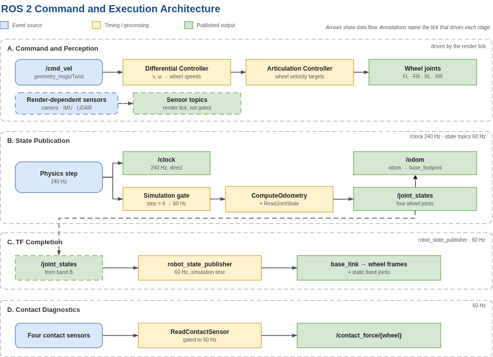

# ROS 2 Interface Architecture

This document summarises the ROS 2 interface implemented for the CobraFlex thesis baseline. It condenses the architecture, timing model, state and sensor semantics, verification evidence, and reinforcement-learning integration boundary described in thesis Chapter 5.

Operational use of the maintained controller and analyzers is documented in [../ros2/README.md](../ros2/README.md).

The machine-readable core topic contract is maintained in [../config/ros2_topics.yaml](../config/ros2_topics.yaml).

The processed interface-acceptance summary is provided in [../validation/ros2_acceptance.csv](../validation/ros2_acceptance.csv).

> **Scope:** the thesis delivers a verified ROS 2 communication interface for subsequent RL integration. It does **not** deliver a complete RL environment, policy, reward function, episode manager, or real-vehicle policy deployment pipeline.

## Architecture overview

The simulation-side interface is implemented with Isaac Sim OmniGraphs plus an external robot_state_publisher.

The architecture separates:

- command processing and render-dependent sensor functions;
- physics-synchronised state publication;
- physics-synchronised wheel-contact diagnostics;
- TF completion through robot_state_publisher.

  

<em>ROS 2 command and execution architecture for the CobraFlex thesis baseline.</em>

The timing domains are deliberately different. Command processing and render-dependent sensors are associated with playback/render execution, while vehicle-state publication is synchronised with physics updates.

## Execution domains and nominal rates

| Component | Trigger | Main responsibility | Nominal simulation-time rate |
| --- | --- | --- | --- |
| ActionGraph_CobraFlex_ADMIT | Playback and message events | Receive commands, generate wheel actuation, run render-dependent sensor paths | Render dependent |
| ActionGraph_ROS_Odom_Physics | Physics step; gate(4) on the state branch | Publish /clock at physics rate and gated odometry, joint states, and raw TF | **240 / 60 Hz** |
| ActionGraph_Wheel_Contact_ROS | Physics step and gate(4) | Publish four-wheel contact diagnostics | **60 Hz** |
| robot_state_publisher | /joint_states | Complete the articulated wheel TF subtree | **60 Hz** |

With a 240 Hz physics rate, gate step 4 gives a 60 Hz physics-synchronised state interface.

The gate reduces middleware and recording load without changing the underlying 240 Hz physics integration.

## Command ingestion and four-wheel actuation

The command path begins at:

~~~text
/cmd_vel
geometry_msgs/msg/Twist
~~~

The main ActionGraph extracts:

~~~text
linear.x  -> V
angular.z -> omega_z
~~~

and applies the differential-drive mapping:

~~~text
omega_L = (V - omega_z * W / 2) / r
omega_R = (V + omega_z * W / 2) / r
~~~

The resulting side commands are duplicated into the four-wheel joint order:

~~~text
[FL, RL, FR, RR]
~~~

and applied as angular-velocity targets through the articulation controller.

The final thesis geometry uses:

~~~text
wheel radius             r = 0.03725 m
wheel-centre separation  W = 0.153 m
~~~

The latest command remains active until a new message is received. Therefore, a **zero Twist must be published before reset or communication shutdown**.

This is an interface behaviour, not a complete stale-command or safe-stop supervisor.

## Simulation time versus wall-clock time

The thesis distinguishes simulation-time cadence from wall-clock throughput.

### Physics-synchronised streams

The final architecture uses:

~~~text
/clock         240 Hz
/odom_truth     60 Hz
/joint_states   60 Hz
dynamic TF      60 Hz
~~~

These rates refer to **simulation time**.

### Render-dependent streams

Rendered sensors can arrive more slowly in wall-clock time when the renderer, recorder, or workstation runs below real time.

For the final Lane Camera acceptance recording:

~~~text
simulation-time rate = 60.000 Hz
wall-arrival rate    = 23.043 Hz
~~~

The lower wall-arrival rate is therefore not interpreted as a change to the simulation-time publication contract.

## State, odometry, and TF publication

At each gated physics update, the base_footprint pose and velocity are computed once.

The same simulated state is supplied to:

~~~text
/odom_truth
/zed/zed_node/odom
~~~

In simulation, these two topics therefore represent the same **physics-derived ground-truth vehicle state**.

/odom_truth uses:

~~~text
header frame: odom
child frame:  base_footprint
~~~

The corresponding:

~~~text
odom -> base_footprint
~~~

transform is generated from the same pose and simulation timestamp.

An external robot_state_publisher consumes /joint_states and completes the four-wheel articulated TF subtree.

### Important provenance distinction

The common ZED topic name does **not** imply an equivalent measurement process.

| Topic | Simulation semantics | Physical-vehicle semantics |
| --- | --- | --- |
| /odom_truth | Physics-derived ground truth | No direct equivalent |
| /zed/zed_node/odom | Physics-derived ground-truth state retained for interface compatibility | ZED visual-inertial odometry |
| /joint_states | Simulated articulation joint state | Physical joint state; separate wheel-speed feedback is also available on hardware |

The physical ZED odometry may exhibit drift, jumps, frozen output, or tracking loss. Those effects are not reproduced by the physics-derived simulation topic.

## Sensor and diagnostic interfaces

The interface exposes simulated perception data and diagnostic signals in addition to vehicle state.

| Function | Isaac Sim interface | Interpretation / limitation |
| --- | --- | --- |
| Lane camera | /camera/image_raw_lane, /camera/camera_info | Intended visual deployment interface; ROS 2 payload and timing verified, appearance equivalence not established |
| LiDAR | /scan | Common transport interface; range, sampling, timing, noise, and reflectance were not calibrated to the physical RPLIDAR A2M4 |
| Stereo RGB | ZED-compatible left/right rectified image topics | Interface availability; physical equivalence requires separate validation |
| Registered depth | ZED-compatible registered-depth topic | Common primary interface; measurement process differs |
| Point cloud | ZED-compatible registered point-cloud topic | Common primary interface; payload characteristics remain platform dependent |
| IMU | /zed/zed_node/imu/data | Common topic name; simulated and measured signals are not assumed equivalent |
| Wheel contact | Four scalar contact-force topics | Descriptive contact/intermittency diagnostics only |
| Wheel command debug | /cobraflex/wheel_cmd_debug | Commanded wheel velocity diagnostic; not a drive-torque measurement |
| Battery | /cobraflex/battery | Fixed **12 V placeholder**, not a simulated electrical state |

The wheel-contact recording path stores scalar contact-sensor output. More detailed normal/friction-force information available from lower-level Isaac Sim contact APIs was not integrated into the thesis recording pipeline.

Solver-internal residuals were also not recorded.

For /cobraflex/wheel_cmd_debug, the jointPositions and jointEfforts fields are zero-filled placeholders and must not be interpreted as measured joint position or torque.

## Functional topic correspondence

The thesis intentionally uses a common ROS 2 interface where practical, while preserving semantic differences between simulation and hardware.

| Function | Isaac Sim | Physical vehicle | Interpretation |
| --- | --- | --- | --- |
| Command | /cmd_vel | /cmd_vel | Common Twist command interface |
| Odometry | /odom_truth; /zed/zed_node/odom | /zed/zed_node/odom | Ground truth in simulation; ZED VIO on hardware |
| Wheel state | /joint_states | /joint_states; /cobraflex/wheel_speeds | Common joint-state interface; hardware also exposes wheel-speed feedback |
| TF / model | /tf; /tf_static; /robot_description | Same principal interfaces | Shared frame/model convention |
| LiDAR | /scan | /scan | Common topic name; sensor characteristics differ |
| IMU | /zed/zed_node/imu/data | Same topic | Common name; measurement semantics differ |
| Lane camera | /camera/image_raw_lane; /camera/camera_info | Same principal interface | Transport/intrinsics compatible; appearance equivalence outside scope |
| Time | /clock | System time | Simulation-time interface only |
| Diagnostics | Contact-force topics; /cobraflex/wheel_cmd_debug | /cobraflex/feedback; /cobraflex/wheel_speeds; /diagnostics | Platform-specific diagnostic signals |

Topic presence demonstrates interface availability. It does not by itself demonstrate measurement equivalence.

## Timing and duplicate-publication correction

The original render-tick odometry path published repeated poses because publication was not synchronised with unique physics updates.

The legacy recording contained approximately:

~~~text
50.1% duplicate odometry poses
~~~

The corrected architecture moved state publication to OnPhysicsStep and drove the state publishers from the odometry-computation execution path.

The final timing architecture is:

~~~text
physics step: 240 Hz
    |
    +--> /clock: 240 Hz
    |
    +--> gate(4): 60 Hz
            |
            +--> odometry
            +--> joint states
            +--> raw TF
~~~

Final evidence included:

- monotonic /clock at 240 Hz;
- /odom_truth, /joint_states, and dynamic TF at 60 Hz;
- **1,925** recorded odom -> base_footprint transforms matching the corresponding odometry poses and timestamps exactly;
- all four wheel transforms available;
- no duplicate samples in the final TF acceptance record;
- no backward time;
- no multiple-parent frames;
- no obsolete world -> base_link transform.

### Joint-state publisher audit

Two ROS2PublishJointState instances remain in the asset, but they serve different runtime roles:

| Node instance | Topic | Runtime role |
| --- | --- | --- |
| ros2_publish_joint_state_01 | /joint_states | Sole active joint-state publisher |
| ros2_publish_joint_state_cml | /cobraflex/wheel_cmd_debug | Command diagnostic publisher |

A historical command-debug recording contained 1,358 messages but only 730 unique timestamps because of duplicate execution.

After the extra execution route was removed, all 45 records in the corrective check had distinct MCAP timestamps.

This supports the topology correction but is not treated as exhaustive proof against every possible duplicate message in every future configuration.

## Verified interface contract

The final thesis acceptance evidence is summarised below.

| Requirement | Final evidence | Status |
| --- | --- | --- |
| /cmd_vel command action | Linear and rotational commands verified; Test 03 also verified simultaneous non-zero (V, omega_z) across the matched 3 x 4 command grid | **Pass** |
| Four-wheel mapping | Correct FL-RL-FR-RR ordering and **99.49–100.73%** four-wheel steady tracking in the matched combined-command grid | **Pass** |
| /clock | Monotonic at **240 Hz** with no duplicate or backward time | **Pass** |
| /odom_truth | **60 Hz**, unique timestamps, exact raw-TF agreement | **Pass** |
| Joint states / TF | One active /joint_states publisher; complete odom-to-wheel TF chain; dynamic transforms at **60 Hz** | **Pass** |
| Lane Camera | **1,221** timestamp-matched Image/CameraInfo pairs; valid **640 x 360 RGB8** payloads; monotonic timestamps; **60.000 Hz** simulation-time rate | **Pass** |
| LiDAR /scan | Transport, frame, angular coverage, and payload structure verified | **Pass — interface scope** |
| Supplementary RGB / depth / IMU | Topics available on both platforms | **Not fully verified** |

For the Lane Camera, the acceptance test verifies ROS 2 transport, payload structure, and timestamp integrity. It does **not** verify:

- image semantics;
- perception accuracy;
- simulation-to-physical appearance equivalence;
- renderer-to-policy latency.

## RL signal classification

The published signals do not all have the same role in a future RL system.

| Signal | Simulation semantics | Physical semantics | Intended RL use |
| --- | --- | --- | --- |
| Lane Camera + CameraInfo | Rendered monocular image | Physical monocular image | **Intended deployment observation** |
| /odom_truth | Ground-truth vehicle state | No equivalent | **Privileged training / reward / evaluation signal** |
| /zed/zed_node/odom | State-derived ground truth | ZED VIO | Interface only; provenance differs |
| /joint_states | Simulated wheel-joint state | Physical joint state; separate wheel-speed feedback available | Optional observation after consistent preprocessing |

A future policy must not depend on /odom_truth as a deployment observation because no physical equivalent exists.

## RL integration boundary

The thesis delivers:

- a simulated CobraFlex vehicle;
- ROS 2 command ingestion;
- four-wheel actuation mapping;
- state publication;
- TF publication;
- principal sensor transport interfaces;
- simulation-time handling;
- interface timing and data-integrity verification.

The thesis does **not** implement:

- observation-vector construction;
- observation normalisation;
- policy-action conversion beyond the ROS 2 command interface;
- reward design;
- termination logic;
- episode management;
- acceleration / slew-rate limiting for an RL policy;
- stale-command protection;
- safe-stop supervision;
- end-to-end policy training;
- real-vehicle RL deployment.

The articulation controller holds its last command indefinitely. Reset logic must therefore explicitly send a zero Twist.

Matching topic names and message types establishes **syntactic compatibility** for the tested interfaces. Semantic and measurement equivalence require separate signal-level validation.

## Handover rules

For future ROS 2 or RL-interface changes:

1. preserve the frozen thesis interface as the historical baseline;
2. keep /clock and state-publication timing changes explicitly versioned;
3. verify that /odom_truth and raw TF still share the same pose and simulation timestamp;
4. verify that only one publisher owns the runtime /joint_states topic;
5. distinguish simulation-time rate from wall-clock arrival rate;
6. treat ZED-compatible odometry as physics-derived ground truth unless an actual visual-inertial model is introduced;
7. do not use placeholder battery or debug-message fields as physical measurements;
8. do not classify /odom_truth as a deployable RL observation;
9. publish zero Twist during reset / shutdown until stale-command and safe-stop supervision are implemented;
10. rerun the ROS 2 acceptance checks in [../HANDOVER.md](../HANDOVER.md) after changing graph topology, topics, timing, or sensor paths.
