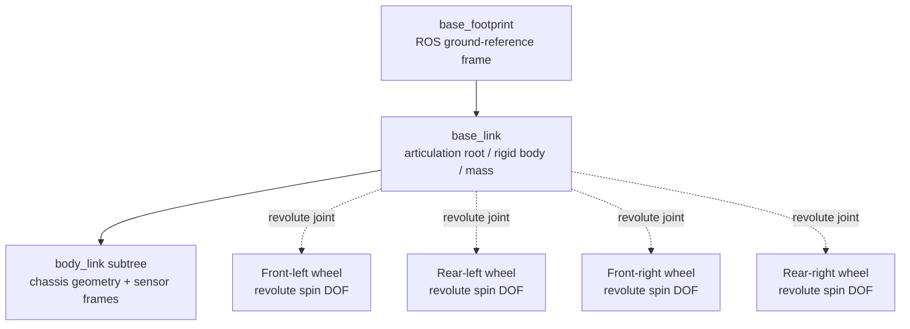

# CobraFlex Vehicle Model

This document summarises the implemented CobraFlex 1:14 vehicle model delivered with the thesis handover. It condenses the implementation and evidence boundaries described in thesis Sections 2.6, 4.2, and 4.3.2.

The formal vehicle asset is:

[`../assets/vehicle/ADMIT14_cobraflex_baseline_v1.usd`](../assets/vehicle/ADMIT14_cobraflex_baseline_v1.usd)

The machine-readable handover configuration is:

[`../config/baseline.yaml`](../config/baseline.yaml)

> **Scope:** this document describes the frozen thesis baseline. Diagnostic ablations, including the 0.08 N.m Max Drive Force condition and matched TGS tests, are not part of the delivered baseline.

<p align="center">
  
</p>

<p align="center"><em>CobraFlex 1:14 vehicle model in the integrated Isaac Sim road environment.</em></p>

## Model architecture

The imported OpenUSD vehicle is implemented as a **PhysX reduced-coordinate articulation** rather than through the PhysX Vehicle SDK.

- `base_footprint` is the ROS ground-reference frame.
- `base_link` is the articulation root rigid body and carries the rigid-body and mass properties.
- the `body_link` subtree contains chassis geometry and sensor frames;
- four wheel prims are connected to `base_link` through revolute joints;
- each wheel has one spin degree of freedom and no steering degree of freedom;
- yaw motion is produced by differential wheel actuation and wheel-ground interaction.



The wheel collision representation uses cylindrical colliders with the physical wheel radius. Turning is not generated by steering joints; it emerges from unequal left/right wheel targets together with longitudinal and lateral contact forces.

## Coordinate convention

The vehicle frame follows the ROS convention used in the thesis:

- **X:** forward;
- **Y:** left;
- **Z:** upward;
- positive yaw: counter-clockwise.

The `base_link` origin is located midway between the front and rear axle lines, midway between the left and right wheel-centre lines, and at wheel-axle height.

## Geometry and mass properties

| Quantity | Frozen value | Evidence / provenance |
| --- | ---: | --- |
| Total mass | **3.5 kg** | Measured on the physical platform; same value used in simulation |
| Wheelbase | **0.154 m** | Measured physical geometry |
| Wheel-centre separation / track width | **0.153 m** | Measured physical geometry used by the final thesis baseline |
| Wheel radius | **0.03725 m** | Physical wheel geometry; used by the simulated wheel colliders |
| CoG X in `base_link` | **+0.006 m** | Measurement-derived |
| CoG Y in `base_link` | **-0.004 m** | Measurement-derived |
| CoG Z in `base_link` | **+0.030 m** | Measurement-derived |
| Approx. CoG height above contact plane | **0.067 m** | Derived from axle height + vertical CoG offset |
| `Ixx` | **0.00854167 kg.m²** | Inherited primitive-geometry approximation |
| `Iyy` | **0.02316 kg.m²** | Inherited primitive-geometry approximation |
| `Izz` | **0.028701667 kg.m²** | Inherited primitive-geometry approximation |

### Centre-of-gravity measurement

The mass-property model deliberately distinguishes measured quantities from inherited modelling assumptions.

The horizontal CoG coordinates were estimated from normalised four-corner static load measurements. With wheelbase `L = 0.154 m` and track width `T = 0.153 m`, the measured load distribution produced approximately:

```text
x_CoG = +0.0060 m
y_CoG = -0.0040 m
```

The positive X value places the CoG about 6 mm forward of the geometric centre. The negative Y value places it about 4 mm toward the vehicle's right side.

The vertical coordinate was estimated using two opposed 30-degree tilt-lift configurations. The method independently reproduced the longitudinal offset and produced approximately:

```text
z_CoG = +0.030 m above the wheel-axle line
```

Because the axle line is one wheel radius above the level contact plane, the resulting CoG height is approximately 0.067 m above the ground-contact plane.

The final model therefore uses:

```text
CoG(X, Y, Z) = (0.006, -0.004, 0.030) m
```

The three coordinates do not have identical evidence strength: X was reproduced by both corner-load and tilt-lift calculations, Y comes from the normalised corner-load distribution, and Z depends on the measured tilt angle and rigid-body assumptions of the tilt-lift method.

## Inertia provenance

The diagonal inertia components were **not experimentally measured** and were **not generated by a CAD mass-properties tool or Isaac Sim automatic inertia calculation**.

They were manually estimated by the original model developer using primitive-geometry approximations and inherited from the original URDF:

```text
Ixx = 0.00854167 kg.m²
Iyy = 0.02316    kg.m²
Izz = 0.028701667 kg.m²
```

These values must therefore be treated as **unvalidated modelling assumptions**, not as experimentally identified vehicle properties.

A matched simulated four-corner load validation was not performed. The implemented CoG is consequently treated as a measurement-derived model input rather than an independently revalidated simulation quantity.

## Skid-steer wheel-target mapping

The ROS 2 command interface supplies desired forward velocity `v` and yaw rate `omega` through `/cmd_vel`.

Under the nominal differential-drive mapping, left- and right-side wheel angular-velocity targets are:

```text
omega_L = (v - omega * W / 2) / r
omega_R = (v + omega * W / 2) / r
```

where:

- `r` is wheel radius;
- `W` is the effective track width used by the kinematic mapping.

The same target is assigned to the front and rear wheels on each side.

These equations define **nominal wheel targets only**. They do not guarantee that the chassis achieves the commanded twist because drive limits, inertia, lateral sliding, and wheel-ground contact remain active.

## Joint-drive configuration

Wheel actuation uses PhysX Articulation Joint Drives.

| Parameter | Frozen baseline |
| --- | ---: |
| Drive mode | **Velocity** |
| Drive type | **Force** |
| Stiffness | **0** |
| Damping | **10,000** on all four wheel joints |
| Max Drive Force | **1.8 N.m per wheel** |

With zero stiffness, the velocity-mode drive acts through the difference between target and actual joint angular velocity. The effort remains bounded by the per-wheel Max Drive Force.

The **0.08 N.m** Max Drive Force condition used in the thesis was a diagnostic ablation and must not be interpreted as the delivered motor-torque limit.

## Frozen physics baseline

The main simulation experiments used the following configuration unless an individual diagnostic explicitly stated otherwise.

| Parameter | Frozen baseline |
| --- | ---: |
| Solver | **PGS** |
| Physics timestep | **1/240 s** |
| Gravity | **9.81 m/s²** |
| Broadphase | **GPU** |
| GPU Dynamics | **Disabled** |
| Continuous collision detection | **Enabled** |
| Enhanced Determinism | **Disabled** |
| Stabilisation | **Disabled** |
| Scene minimum position / velocity iterations | **32 / 1** |
| Articulation position / velocity iterations | **128 / 1** |
| Joint-drive mode / type | **Velocity / Force** |
| Joint-drive stiffness | **0** |
| Joint-drive damping | **10,000** |
| Max Drive Force | **1.8 N.m per wheel** |
| `base_link` angular / linear damping | **0.05 / 0** |
| Wheel and floor static / dynamic friction | **0.5 / 0.4** |
| Friction combine mode | **Multiply** |
| Effective static / dynamic friction | **0.25 / 0.16** |
| Contact / rest offset | **Automatic (-inf USD sentinel)** |
| Torsional / minimum torsional patch radius | **0 / 0 m** |
| Collision system | **PCM** |
| Friction type | **Patch** |
| Friction correlation distance | **0.025 m** |
| Friction offset threshold | **0.040 m** |

The distinction between **scene minimum iterations (32/1)** and **articulation iterations (128/1)** is intentional and matches the final thesis baseline.

## Wheel-ground friction interpretation

The 0.5 / 0.4 wheel and floor friction values were baseline modelling parameters, **not measured friction coefficients of the physical tyre-surface pair**.

Because both materials use the Multiply combine mode, the corresponding effective coefficients are:

```text
effective static friction  = 0.5 x 0.5 = 0.25
effective dynamic friction = 0.4 x 0.4 = 0.16
```

The thesis treated these coefficients as tunable contact parameters. Friction sweeps did not identify one isotropic setting that improved agreement consistently across the tested manoeuvres, so the baseline values were retained rather than fitted to a single test condition.

## Command-to-measurement pipeline

The implemented vehicle model sits inside the following simulation path:

<p align="center">
  
</p>

<p align="center"><em>ROS 2 command and state-feedback path through the CobraFlex articulation and PhysX simulation.</em></p>

| Stage | Function | Implementation |
| ---: | --- | --- |
| 1 | Command ingress | ROS 2 bridge receives `(v, omega)` from `/cmd_vel` |
| 2 | Wheel-target generation | Differential-drive inverse kinematics generates left/right wheel angular-velocity targets |
| 3 | Joint-drive actuation | Four velocity-mode Joint Drives generate bounded drive effort from target-versus-actual joint velocity |
| 4 | Multibody + contact solution | PhysX advances the reduced-coordinate articulation and resolves joint and wheel-ground contact constraints under PGS with isotropic Coulomb friction |
| 5 | Physics-state advancement | Generalised velocities, joint positions, and rigid-body poses advance at **240 Hz** |
| 6 | State / sensor readout | Chassis pose/twist, joint states, IMU quantities, and diagnostic contact information are obtained or derived |
| 7 | ROS 2 publication + recording | Configured streams are published in simulation time and recorded with rosbag2 for offline validation |


## Why an articulation model?

The delivered model keeps the chassis-wheel topology explicit:

- wheel positions and velocities remain directly accessible through articulation states;
- each wheel is represented by a real collision geometry and revolute joint;
- turning is produced through differential wheel actuation and resolved wheel-ground contact;
- ROS 2 wheel-velocity targets map directly to the four wheel-joint drives.

This differs structurally from the PhysX Vehicle SDK, which provides a dedicated vehicle framework with internal suspension, tyre, and drivetrain abstractions. The thesis model was built around the articulation representation and its explicit joint/contact behaviour.

## Interpretation limits

The model is a calibrated research baseline, not a complete identification of the physical vehicle.

In particular:

- physical wheel-surface friction was not measured;
- diagonal inertia remains an inherited approximation;
- static simulated wheel-load distribution was not independently validated against the physical four-corner measurements;
- the physical demand-dependent curved-path understeer was not reproduced;
- pitch sensitivity remains substantially under-predicted;
- higher-rate in-place rotation exhibits multiple simulation response branches;
- solver-dependent rotational behaviour remains unresolved.

For quantified Sim-to-Real results, see [`../validation/README.md`](../validation/README.md).

## Change-control rule

The formal vehicle asset and frozen configuration are historical thesis deliverables.

Do not overwrite:

```text
assets/vehicle/ADMIT14_cobraflex_baseline_v1.usd
```

For future model changes:

1. create a new versioned USD;
2. record the changed mass, inertia, drive, contact, solver, or geometry parameters;
3. rerun the ROS 2 and dynamics acceptance checks;
4. keep historical thesis results tied to the original `v1` configuration.

Repository-wide experiment and tool provenance is documented in [`data_provenance.md`](data_provenance.md).
