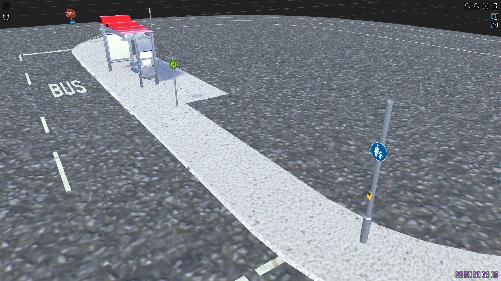
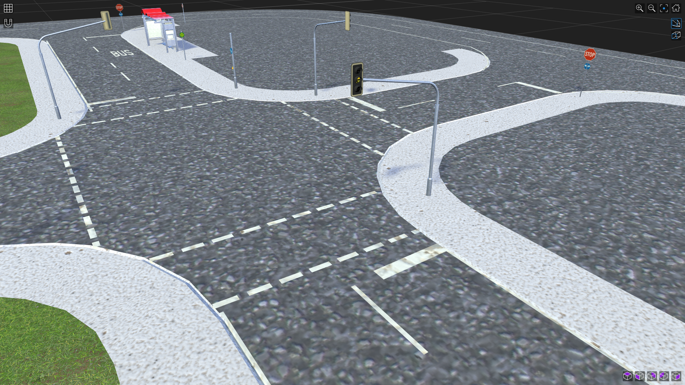
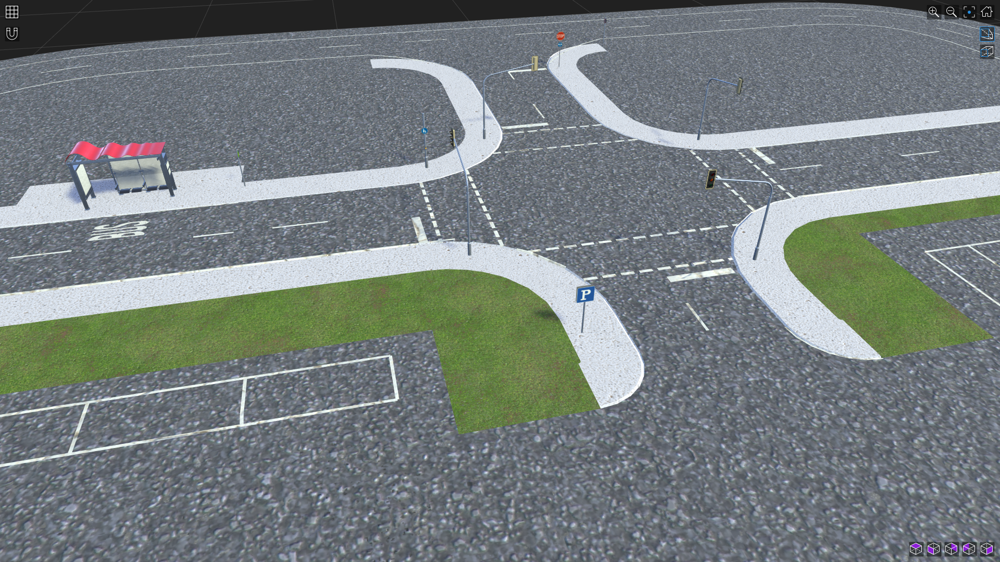

# CobraFlex RoadRunner Environment

This directory contains the road-environment handover for the CobraFlex digital-twin platform. The environment was authored in **MathWorks RoadRunner R2025b** and transferred to the Isaac Sim workflow through OpenUSD, while **ASAM OpenDRIVE 1.6** is retained as the logical road-network representation.

This README condenses the map design, standards traceability, operating-domain boundaries, exchange formats, geometry limitations, and validation evidence described in Section 4.1 of the thesis.

> **Scope note:** the environment is **standards-informed**. It is not claimed to be a geometrically compliant 1:14 reproduction of every full-scale road-design requirement.

## Overview

The road network is divided into three functional zones:

| Zone | Main purpose and content |
| --- | --- |
| **Outer Urban Loop** | Continuous circulation route with two- and three-lane segments |
| **Central Urban Network** | Signal-controlled four-arm intersection, sidewalks, a bus stop, and three give-way-controlled connections |
| **Parking Area** | Parallel- and reverse-parking sections connected to the wider network |

The final network was designed as a compact indoor research environment for a 1:14 skid-steer vehicle. It combines road geometry, markings, intersections, parking features, and machine-readable connectivity in one reusable test environment.

## Visual Overview

The following views illustrate representative elements of the delivered road environment, including the bus-stop area, the central signal-controlled intersection, and the parking-area access.

  

<em>Bus-stop area with road markings, sidewalk, roadside signs, and street furniture.</em>

  

<em>Central signal-controlled intersection with lane markings and pedestrian infrastructure.</em>

  

<em>Parking-area access connected to the central urban road network.</em>

## Design references

The road environment uses several standards and guidelines for different purposes. They should not be interpreted as interchangeable or as a single compliance claim.

| Reference | Use in this environment |
| --- | --- |
| **RASt 06** | Urban-road layout, cross-sections, lane widths, horizontal-radius references, and intersection design context |
| **RMS-1** | Road-marking geometry and layout |
| **DIN EN 1436** | Road-marking performance reference; not used as a marking-geometry standard |
| **R-FGÜ 2001** | Pedestrian-crossing design reference |
| **ISO 34503:2023** | Taxonomy for describing the supported Operational Design Domain (ODD) |
| **ASAM OpenDRIVE 1.6** | Machine-readable road-network exchange: reference lines, lanes, junctions, and connectivity |
| **OpenUSD** | Three-dimensional scene transfer into Isaac Sim |

ISO 34503 is used to structure the operating-domain description. It is **not** used as a geometric road-design standard.

## Key authored dimensions

Selected full-scale references were converted to the 1:14 environment where practical. Some dimensions were adapted to the laboratory platform rather than reproduced by one uniform scale factor.

| Element | Reference | Full-scale value | 1:14 reference | Authored value |
| --- | --- | ---: | ---: | ---: |
| Driving lane width | RASt 06 | 3.50 m | 0.250 m | **0.250 m** |
| Sidewalk width | RASt 06 | 2.50 m | 0.179 m | **0.180 m** |
| Sidewalk at bus stop | RASt 06 | 5.00 m | 0.357 m | **0.360 m** |
| Parking aisle width | RASt 06 | 3.50–4.75 m | 0.250–0.339 m | **0.300 m** |
| Perpendicular parking-bay width | RASt 06 | 2.50 m | 0.179 m | **0.200 m** |
| Parallel parking-bay width | RASt 06 | 2.00 m | 0.143 m | **0.183 m** |
| Guide-line width | RMS-1 | 0.12 m | 0.0086 m | **0.009 m** |
| Dash / gap length | RMS-1 | 3.00 / 6.00 m | 0.214 / 0.429 m | **0.214 / 0.429 m** |

These values document the authored RoadRunner geometry and its traceability. They do not imply full dynamic or regulatory similitude between the scaled environment and a full-size road.

## Geometry limitations

The laboratory footprint prevents all full-scale horizontal-geometry requirements from being preserved under a strict 1:14 scale.

### Outer loop

For the RASt 06 50 km/h reference case:

- full-scale minimum radius: **80 m**;
- strict 1:14 reference: **5.71 m**;
- achieved minimum radius in the exported loop: approximately **0.68–1.07 m**.

The outer loop uses continuous curvature transitions, but its absolute radius is therefore **scale-limited and not compliant with the strict scaled RASt 06 radius reference**.

### Junction corner

The authored junction-corner radius is **0.571 m**:

- it matches the 1:14-scaled **8 m right-entry** reference;
- it does not demonstrate the 1:14-scaled **12 m right-turn** reference of **0.857 m**.

The geometry therefore retains traceability to the design references while explicitly documenting where laboratory constraints prevent strict reproduction.

## Operational Design Domain

The ODD description follows the ISO 34503 taxonomy. The map is intended for a bounded indoor research environment rather than unrestricted urban-road simulation.

| ODD aspect | CobraFlex environment |
| --- | --- |
| Zones | Outer urban loop, central urban network, parking area |
| Drivable-area type | Scaled urban roads and parking aisles |
| Geometry | Level surface; straight, clothoid, and junction-arc geometry |
| Lane specification | Two- and three-lane segments; 0.250 m driving lanes; defined travel directions |
| Signs and markings | Traffic signals, regulatory signs, centre/edge markings, crosswalk, bus-stop and parking markings |
| Roadside / edge features | Curbs, shoulders, sidewalks, and medians |
| Surface | One uniform physics-material region |
| Weather | Indoor operation; no rain, snow, or wind modelling |
| Particulates | No fog, mist, dust, or smoke |
| Illumination | Constant artificial illumination; no day/night or glare variation |
| Connectivity | No V2X operating condition |
| Traffic agents | No additional vehicles, pedestrians, cyclists, or animals |
| Special / temporary structures | No bridges, tunnels, toll plazas, level crossings, or roadworks |
| Subject vehicle | One CobraFlex 1:14 skid-steer platform within the tested command range |

Motorway, rural-road, off-road, adverse-weather, mixed-traffic, and temporary-roadwork scenarios are outside the implemented ODD.

## Delivered map assets

The same authored environment is represented through complementary formats:

| File | Role |
| --- | --- |
| [`../assets/environment/ADMIT14_RoadRunner_Map_v1.usd`](../assets/environment/ADMIT14_RoadRunner_Map_v1.usd) | Formal 3D environment asset used by Isaac Sim |
| [`OpenDRIVE/ADMIT14_RoadRunner_Map_v1.xodr`](OpenDRIVE/ADMIT14_RoadRunner_Map_v1.xodr) | Logical road network: reference lines, lanes, junctions, and connectivity |
| [`GeoJSON/ADMIT14_RoadRunner_Map_v1.geojson`](GeoJSON/ADMIT14_RoadRunner_Map_v1.geojson) | Lightweight geometry representation used for audit and supporting workflows |
| [`docs/junction63_repair_report.md`](docs/junction63_repair_report.md) | Provenance and acceptance record for the final Junction 63 connector repair |

The handover filenames intentionally use the same `ADMIT14_RoadRunner_Map_v1` naming as the formal USD environment asset.

## Physics-material boundary

RoadRunner materials in this workflow are used for scene appearance and geometry authoring. The wheel–ground friction parameters used for vehicle-dynamics calibration are configured separately in Isaac Sim / PhysX.

OpenDRIVE can represent road-material information, but those values were not used as the tyre–surface calibration source for the thesis.

## OpenDRIVE and GeoJSON validation

The final road-network audit checked:

- OpenDRIVE schema / export integrity;
- reference-line continuity through junction connectors;
- lane travel direction;
- lane and junction connectivity;
- consistency of the lightweight GeoJSON representation used for geometric inspection.

The final delivered network is represented as a **single connected road network** with defined travel directions on the drivable lanes.

## Junction 63 repair

The final OpenDRIVE file contains repaired connector roads **306** and **322** at Junction 63.

The repair:

- preserves the connector endpoints;
- preserves start and end headings;
- preserves road and lane identifiers;
- preserves Junction 63 connectivity;
- replaces the local fold-back geometry with monotonic cubic connector geometry.

Road 8 was merged into Road 19 during the same late map-cleanup process, and Road 19 retains the required ordered lane sections.

See [`docs/junction63_repair_report.md`](docs/junction63_repair_report.md) for the detailed repair and acceptance record.

## RL lane assets

The map package also includes lightweight directed lane representations for downstream route-planning and reinforcement-learning work:

| File | Purpose |
| --- | --- |
| [`RL/lane_centrelines.csv`](RL/lane_centrelines.csv) | Ordered centreline samples for each logical driving lane, stored in vehicle travel direction |
| [`RL/lane_network.json`](RL/lane_network.json) | Directed predecessor/successor graph, lane metadata, lengths, and OpenDRIVE road/lane mapping |
| [`RL/README.md`](RL/README.md) | Generation conventions, coordinate reconstruction, and direction handling |

These files are newly generated handover convenience assets derived from the final GeoJSON/OpenDRIVE pair. They are not presented as byte-identical copies of earlier development-time lane assets. The versioned OpenDRIVE file remains the logical road-network source.

## Validation provenance

The current OpenDRIVE handover file includes the **2026-08-16 Junction 63 repair**. It postdates the frozen **2026-08-12 dynamics-validation baseline**.

Therefore:

- historical thesis dynamics results are not presented as reruns with the later OpenDRIVE export;
- the later OpenDRIVE repair does not retroactively change the recorded thesis validation results;
- any future scene regenerated from the repaired road network should receive a new version and a new validation record.

See [`../docs/data_provenance.md`](../docs/data_provenance.md) for the repository-wide provenance hierarchy.

## Versioning

Do not overwrite the `v1` map or USD files in place. Future geometry, connectivity, material, or scene-integration changes should use a new versioned filename and be documented separately.
